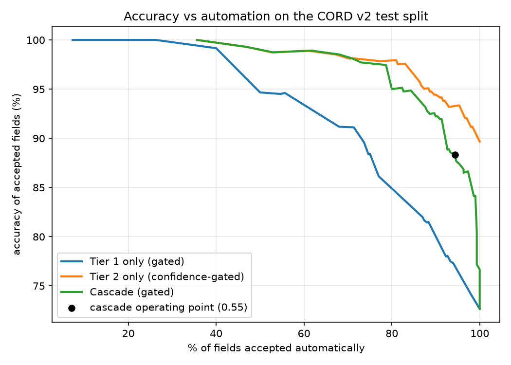

# receipt-cascade

An LLM receipt extractor that scores its own confidence per field, sends only the shaky fields to a stronger model, and plots accuracy against how much gets automated. On CORD v2 the cascade came close to the strong model's accuracy at lower cost, but simply running the strong model and gating on its confidence did better. The per-field confidence score is the part that worked.



## Results

CORD v2 test split, 100 receipts, 300 scored fields. The dev split (100 receipts, 311 fields) was used to fit the confidence models and pick the threshold. Everything below is produced by `make eval` and copied from `results_table_layout.md` and `results_layout.json`.

| Policy | Fields automated | Accuracy of automated fields | Accuracy if reviewed fields are fixed | Cost per 1,000 receipts | Mean latency (s) |
| --- | --- | --- | --- | --- | --- |
| Tier 1 only (gpt-4o-mini on OCR text, 3 runs) | 100.0% | 72.7% | 72.7% | $0.31 | 2.0 |
| Tier 2 only (gpt-4o on the image) | 100.0% | 89.7% | 89.7% | $3.34 | 1.9 |
| Tier 2 only, gated at the same threshold (0.55) | 91.7% | 93.8% | 94.3% | $3.34 | 1.9 |
| Cascade (threshold 0.55) | 94.3% | 88.3% | 89.0% | $2.75 | 3.4 |

"Accuracy of automated fields" only counts fields the system accepted. "Accuracy if reviewed fields are fixed" assumes a human corrects every `needs_review` field.

What this says:

- The cascade is 18% cheaper than Tier 2 only ($2.75 vs $3.34) and 1.4 points less accurate (88.3% vs 89.7%). That is close to the "within about one point" target I set, but not inside it.
- Gating Tier 2 on its own confidence beats the cascade at the same threshold: 93.8% accuracy on 91.7% of fields, at the same cost as plain Tier 2.
- At stricter thresholds the cascade loses its cost advantage: at 0.70 it escalates 99 of 100 receipts and costs $3.61 per 1,000, more than Tier 2 alone.
- 100 test receipts is small. Bootstrap 95% intervals (resampling receipts) are 85.9 to 93.5% for Tier 2 only and 84.8 to 91.7% for the cascade, so the two overlap heavily.

Tier 1 input matters. The first version fed Tier 1 flat OCR text and got 66.3% for Tier 1 and 84.2% for the cascade (`results_table_plain.md`). Joining boxes that sit on the same visual row into one line raised those to 72.7% and 88.3%. It helped totals most (69.5% to 86.3%) and line items barely at all (47.5% to 50.5%), so keeping rows together is only part of why Tier 1 struggles with line items.

## How it works

1. Tier 1 runs gpt-4o-mini three times (temperature 0.7) on the RapidOCR text of the receipt, with boxes on the same row joined into one line.
2. Each field gets three signals: agreement across the three runs, whether the validators passed (line items sum to subtotal, subtotal + tax = total, date parses), and whether the value appears in the plain OCR text.
3. A small logistic regression fit on dev turns the signals into a probability that the field is correct (`confidence.py`).
4. Fields under the threshold are replaced by gpt-4o's reading of the image. Fields still under the threshold after that are marked `needs_review`.

Tier 1 reads OCR text and not the image on purpose. In a first pilot I gave gpt-4o-mini the image and it cost $11.08 per 1,000 receipts against $3.18 for gpt-4o, because mini bills a receipt image at about 25,000 input tokens. A "cheap" tier that costs more than the strong one is not a cascade. The side effect is that the OCR-match signal is weaker for Tier 1, since the model read the same text it is checked against.

Choices worth knowing about:

- **Scored fields.** Only fields CORD labels are scored: line items, subtotal, tax, total. Subtotal and tax are scored only on receipts that have them. CORD has no merchant or date labels, so those are extracted and validated but not in the accuracy numbers.
- **Line item matching.** A field is correct if every item matches one-to-one with the same quantity and price and a name similarity of at least 0.8. This is strict, so line items are the hardest field.
- **Escalation is per field, billing is per receipt.** Only uncertain fields take the Tier 2 value, but a Tier 2 call reads the whole image, so the cost counts one call for any receipt with at least one escalated field.
- **Threshold choice.** Picked on dev as the highest-coverage threshold whose accepted-field accuracy stays within one point of Tier 2 on everything.
- **Cost.** Computed from token usage recorded in the cache and the prices in `config.py` (OpenAI list prices, check before quoting).

## Output format

`make eval` writes one JSON per test receipt to `out/test_layout/`. Downstream projects read this shape:

```json
{
  "receipt_id": "test-000",
  "image_sha256": "...",
  "overall_confidence": 0.93,
  "fields": {
    "total": {"value": "45,500", "confidence": 0.97, "tier": 1, "status": "accepted"},
    "line_items": {"value": [{"name": "EGG TART", "quantity": 1, "price": "13,000"}],
                   "confidence": 0.41, "tier": 2, "status": "needs_review"}
  }
}
```

`overall_confidence` is the minimum over the four scored fields. `status` is `accepted` or `needs_review`. Amounts are strings as printed on the receipt.

## Run it

```bash
python -m venv .venv
.venv/Scripts/python.exe -m pip install -r requirements.txt   # use .venv/bin/python on Linux/macOS
make eval    # replays cache/, no API key needed, rewrites results, curves and out/
make test
python make_table_image.py   # renders table_layout.png from results_layout.json
```

The CORD v2 validation and test parquet files go in `data/data/` (download from the dataset page linked below). To rerun against the API instead of the cache, copy `.env.example` to `.env`, add an OpenAI key, and delete `cache/llm/`. A full run costs a few dollars.

To try it on your own receipt, the pieces to reuse are `ocr.py` (image to row-joined text), `extract.py` (one model call with a Pydantic schema) and `confidence.py` (the per-field score). There is no one-command CLI for a single image yet.

## Limitations

- Small test set (100 receipts), one dataset, one prompt per tier. No prompt tuning was done on Tier 1.
- Tier 1 line items are still weak (50.5% against 86.9% for Tier 2) and I do not know why. Row-joining did not fix it.
- The confidence model and the threshold were fit on the same 100 dev receipts, so dev numbers are optimistic. Test numbers are not.
- The subtotal validator fires on 40 of 62 correct subtotals, so it is a noisy signal. The total validator is much better: it flagged all 13 wrong Tier 1 totals, with 23 false alarms on 82 correct ones.
- RapidOCR was used because it installs with pip. Tesseract or a cloud OCR could change Tier 1 a lot.
- The row-joining test ran after the first full evaluation, on the same test split. The plain-text run is kept in the repo so both results are visible.

## What is next

Look at why Tier 1 line items fail (is it OCR, name matching or the strict price and quantity rule?), and try Tier 2 prompted for only the uncertain fields.

## Credits

- Data: [CORD v2](https://huggingface.co/datasets/naver-clova-ix/cord-v2) by Naver Clova (Park et al., "CORD: A Consolidated Receipt Dataset for Post-OCR Parsing", 2019), CC BY 4.0. The images are not redistributed here.
- OCR: [RapidOCR](https://github.com/RapidAI/RapidOCR) (ONNX runtime).
- Models: OpenAI gpt-4o-mini and gpt-4o.
- Idea: routing cheap-then-expensive model calls by a confidence score follows [FrugalGPT](https://arxiv.org/abs/2305.05176) (Chen, Zaharia, Zou, 2023). What is different here is applying it per field on receipts, with validators as a signal, and reporting the cost side honestly.

MIT license, see `LICENSE`.
