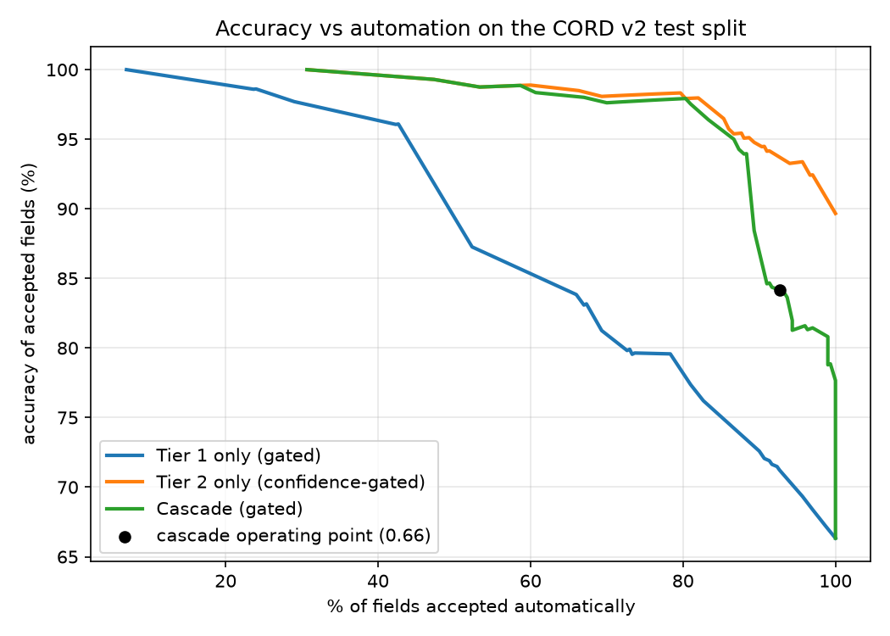

# receipt-cascade

An LLM receipt extractor that scores its own confidence per field, sends only the shaky fields to a stronger model, and plots accuracy against how much gets automated. The headline result is a negative one: on CORD v2 the cheap-then-strong cascade did not beat simply running the strong model and gating on its confidence. The per-field confidence score is the part that worked.



## Results

CORD v2 test split, 100 receipts, 300 scored fields. Dev split (100 receipts, 311 fields) was used to fit the confidence models and pick the threshold. Everything below is produced by `make eval` and copied from `results_table.md` and `results.json`.

| Policy | Fields automated | Accuracy of automated fields | Accuracy if reviewed fields are fixed | Cost per 1,000 receipts | Mean latency (s) |
| --- | --- | --- | --- | --- | --- |
| Tier 1 only (gpt-4o-mini on OCR text, 3 runs) | 100.0% | 66.3% | 66.3% | $0.30 | 2.1 |
| Tier 2 only (gpt-4o on the image) | 100.0% | 89.7% | 89.7% | $3.34 | 1.9 |
| Tier 2 only, gated at the same threshold (0.66) | 90.3% | 94.5% | 95.0% | $3.34 | 1.9 |
| Cascade (threshold 0.66) | 92.7% | 84.2% | 85.3% | $2.61 | 3.5 |

"Accuracy of automated fields" only counts fields the system accepted. "Accuracy if reviewed fields are fixed" assumes a human corrects every `needs_review` field.

What this says:

- The cascade was 22% cheaper than Tier 2 only ($2.61 vs $3.34) and 5.5 points less accurate (84.2% vs 89.7%). It misses the "within about one point" target.
- Confidence gating on Tier 2 alone is better than the cascade at the same threshold: 94.5% accuracy on 90.3% of fields.
- At a stricter threshold (0.80) the cascade reaches 97.5% on 81% of fields but costs $3.61 per 1,000 receipts, more than Tier 2 alone ($3.34), because 99 of 100 receipts still have at least one field escalated.
- 100 test receipts is small. Bootstrap 95% intervals (resampling receipts) are 85.9 to 93.5% for Tier 2 only and 79.8 to 88.3% for the cascade, so the gap is real but the exact size is not tight.

## How it works

1. Tier 1 runs gpt-4o-mini three times (temperature 0.7) on the RapidOCR text of the receipt.
2. Each field gets three signals: agreement across the three runs, whether the validators passed (line items sum to subtotal, subtotal + tax = total, date parses), and whether the value appears in the OCR text.
3. A small logistic regression fit on dev turns the signals into a probability that the field is correct (`confidence.py`).
4. Fields under the threshold are replaced by gpt-4o's reading of the image. Fields still under the threshold after that are marked `needs_review`.

Tier 1 reads OCR text and not the image on purpose. In a first pilot I gave gpt-4o-mini the image and it cost $11.08 per 1,000 receipts against $3.18 for gpt-4o, because mini bills a receipt image at about 25,000 input tokens. A "cheap" tier that costs more than the strong one is not a cascade, so Tier 1 got text. That change makes the OCR-match signal weaker for Tier 1, since the model read the same text it is checked against.

Choices worth knowing about:

- **Scored fields.** Only fields CORD labels are scored: line items, subtotal, tax, total. Subtotal and tax are scored only on receipts that have them. CORD has no merchant or date labels, so those are extracted and validated but not in the accuracy numbers.
- **Line item matching.** A field is correct if every item matches one-to-one with the same quantity and price and a name similarity of at least 0.8. This is strict, so line items are the hardest field.
- **Escalation is per field, billing is per receipt.** Only uncertain fields take the Tier 2 value, but a Tier 2 call reads the whole image, so the cost counts one call for any receipt with at least one escalated field.
- **Threshold choice.** Picked on dev as the highest-coverage threshold whose accepted-field accuracy stays within one point of Tier 2 on everything.
- **Cost.** Computed from token usage recorded in the cache and the prices in `config.py` (OpenAI list prices, check before quoting).

## Output format

`make eval` writes one JSON per test receipt to `out/test/`. Downstream projects read this shape:

```json
{
  "receipt_id": "test-000",
  "image_sha256": "...",
  "overall_confidence": 0.93,
  "fields": {
    "total": {"value": "45,500", "confidence": 0.97, "tier": 1, "status": "accepted"},
    "line_items": {"value": [{"name": "EGG TART", "quantity": 1, "price": "13,000"}],
                   "confidence": 0.41, "tier": 2, "status": "needs_review"}
  }
}
```

`overall_confidence` is the minimum over the four scored fields. `status` is `accepted` or `needs_review`. Amounts are strings as printed on the receipt.

## Run it

```bash
python -m venv .venv
.venv/Scripts/python.exe -m pip install -r requirements.txt   # use .venv/bin/python on Linux/macOS
make eval    # replays cache/, no API key needed, rewrites results and curve.png
make test
```

The CORD v2 validation and test parquet files go in `data/data/` (download from https://huggingface.co/datasets/naver-clova-ix/cord-v2). To rerun against the API instead of the cache, copy `.env.example` to `.env`, add an OpenAI key, and delete `cache/llm/`. A full run is a few dollars.

## Limitations

- Small test set (100 receipts), one dataset, one prompt per tier. No prompt tuning was done on Tier 1.
- Tier 1 on OCR text is weak: 47% on line items against 87% for Tier 2. My guess is that flat OCR text loses the column layout that ties quantities to prices, but I did not test that.
- The confidence model and the threshold were fit on the same 100 dev receipts, so dev numbers are optimistic. Test numbers are not.
- The subtotal validator fires on 38 of 59 correct subtotals, so it is a noisy signal. The total validator is much better (see RESULTS.md).
- RapidOCR was used because it installs with pip. Tesseract or a cloud OCR could change Tier 1 a lot.

## What is next

A layout-aware OCR (or sending Tier 1 a cropped image at low detail) is the obvious way to try to make Tier 1 good enough to skip Tier 2 more often.

Inspired by the confidence-routing ideas in the LLM cascade literature (FrugalGPT in particular), applied here at field level on receipts. Data: CORD v2 (Park et al.), CC BY 4.0.
